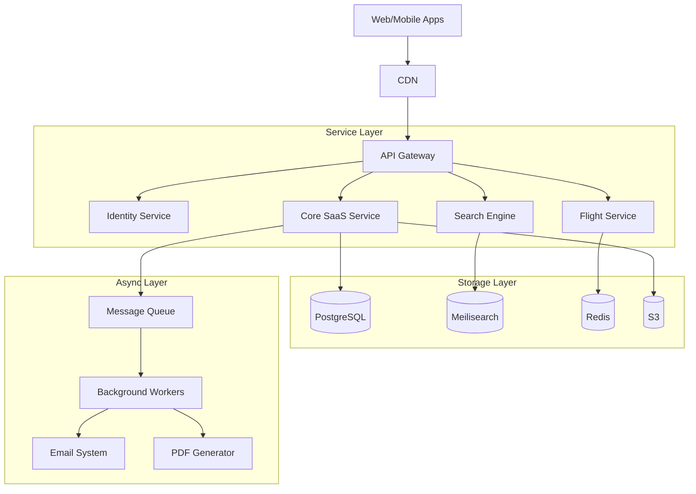

# Enterprise Tour & Flight Booking SaaS Portal
## Enhanced Specification & Implementation Guide

---

## 1. PROJECT OVERVIEW

### 1.1 Executive Summary
This document serves as the master blueprint for building an enterprise-grade SaaS platform for the travel industry. The system supports multiple tenants (Travel Agents, Tour Operators) to manage inventory, sell custom packages, and resell third-party inventory (GDS Flights, Aggregated Tours) through a unified interface.

### 1.2 Core Vision
To create a "Travel Operating System" that combines:
1. **Inventory Management:** Like Shopify for Tours.
2. **Distribution:** Like Expedia for B2C sales.
3. **Intelligence:** AI-driven dynamic pricing and itinerary generation.

---

## 2. FUNCTIONAL REQUIREMENTS (Detailed)

### 2.1 Package Management System
- **Custom Inventory:** Tour operators can create rich itinerary-based packages.
  - *Fields:* Day-wise schedule, Inclusions/Exclusions, Pickup points, Metadata.
  - *Pricing:* Seasonal rates, Group tiered pricing, Child policy.
  - *Inventory:* Stocks per departure date, blackout dates.
- **Third-Party Integration (Aggregators):**
  - Connectors for Viator, GetYourGuide, TourRadar.
  - **Normalization Engine:** Maps diverse API responses to a standard internal schema.
  - **Real-time Sync:** Webhooks/Polling for availability & price updates.

### 2.2 Flight Booking Engine
- **Search:** Multi-GDS (Amadeus, Sabre) + LCC aggregation (TripJack).
- **Booking Flow:** Search -> Select -> Price Check -> PNR Creation -> Payment -> Ticket Issuance.
- **Features:**
  - One-way, Round-trip, Multi-city.
  - Baggage information & Fare Rules display.
  - Split PNR handling (different airlines for outbound/return).

### 2.3 Booking & Order Management
- **Unified Cart:** Add Flight + Hotel + Tour in a single checkout.
- **Order Lifecycle:** Pending -> Confirmed -> Partially Paid -> Completed -> Cancelled.
- **Post-Booking:**
  - Auto-generation of Vouchers & E-Tickets (PDF).
  - Modification/Cancellation requests workflow.
- **Groups:** Split payments for large groups.

### 2.4 Agent & B2B Portal
- **Hierarchy:** Super Admin -> Agency Admin -> Agent -> Sub-agent.
- **Commercials:** 
  - Markup management (Global, Supplier-wise, Rule-based).
  - Credit Limits & Wallet system for Agents.
- **White-labeling:** Agents can host their own B2C site with custom domain/branding.

### 2.5 AI & Intelligence Layer
- **Itinerary Generator:** "Create a 5-day romantic trip to Paris under $2000" -> Generates bookable plan.
- **Dynamic Pricing:** Suggests optimal margins based on demand signals.
- **Smart Support:** Chatbot for "Where is my ticket?" or "Change my date" queries.

---

## 3. TECHNICAL ARCHITECTURE

### 3.1 High-Level Design
We utilize a **Modular Monolith** approach evolving into **Microservices** for critical components.



### 3.2 Technology Stack

| Layer | Technology | Decision Rationale |
| :--- | :--- | :--- |
| **Frontend** | Next.js 14, TypeScript | Server Components for SEO, exceptional DX, generic data fetching. |
| **UI Framework** | Tailwind CSS, Shadcn UI | Rapid UI development, accessible primitives, easy customization. |
| **Backend** | FastAPI (Python 3.12) | High performance (async), strong typing (Pydantic), great ecosystem for AI/Data. |
| **Database** | PostgreSQL 16 | JSONB support allows flexbility for package attributes; solid reliability. |
| **Cache** | Redis Stack | Caching items + Pub/Sub for real-time updates. |
| **Search** | Meilisearch / Elastic | Typo-tolerant, fast search for thousands of packages. |
| **Infra** | Docker, Kubernetes | Standard container orchestration for scalability. |

---

## 4. DATABASE SCHEMA DESIGN

### 4.1 Key Tables

#### `users` & `agents`
```sql
CREATE TABLE users (
    id UUID PRIMARY KEY DEFAULT gen_random_uuid(),
    email VARCHAR(255) UNIQUE NOT NULL,
    password_hash VARCHAR NOT NULL,
    role VARCHAR(50) DEFAULT 'customer',
    is_active BOOLEAN DEFAULT TRUE,
    created_at TIMESTAMPTZ DEFAULT NOW()
);

CREATE TABLE agencies (
    id UUID PRIMARY KEY,
    owner_id UUID REFERENCES users(id),
    company_name VARCHAR(255),
    credit_balance DECIMAL(15,2) DEFAULT 0,
    branding_config JSONB -- { logo_url: "...", colors: {...} }
);
```

#### `packages` (Unified Model)
```sql
CREATE TABLE packages (
    id UUID PRIMARY KEY,
    slug VARCHAR(255) UNIQUE,
    title VARCHAR(255),
    description TEXT,
    
    -- Inventory Control
    supplier_type VARCHAR(50), -- 'internal', 'viator', 'gyg'
    supplier_id VARCHAR(255),  -- External ID from provider
    
    -- Pricing & Availability
    price_start DECIMAL(10,2),
    currency VARCHAR(3) DEFAULT 'USD',
    
    -- Content
    images TEXT[],
    itinerary JSONB, -- [ { day: 1, title: "Arrival", description: "..." } ]
    inclusions TEXT[],
    exclusions TEXT[],
    
    -- Metadata
    destination_tags TEXT[], -- ['Paris', 'France', 'Europe']
    categories TEXT[], -- ['Honeymoon', 'Adventure']
    
    created_at TIMESTAMPTZ,
    updated_at TIMESTAMPTZ
);
```

#### `bookings` (Transactional)
```sql
CREATE TABLE bookings (
    id UUID PRIMARY KEY,
    pnr VARCHAR(20) UNIQUE, -- Public reference
    user_id UUID REFERENCES users(id),
    agency_id UUID REFERENCES agencies(id),
    
    total_amount DECIMAL(12,2),
    net_amount DECIMAL(12,2), -- Cost to platform
    markup_amount DECIMAL(12,2), -- Agent profit
    currency VARCHAR(3),
    
    status VARCHAR(50), -- PENDING, CONFIRMED, FAILED, CANCELLED
    payment_status VARCHAR(50),
    
    pax_details JSONB, -- snapshot of traveler info
    contact_info JSONB,
    
    created_at TIMESTAMPTZ
);

CREATE TABLE booking_line_items (
    id UUID PRIMARY KEY,
    booking_id UUID REFERENCES bookings(id),
    type VARCHAR(20), -- 'flight', 'tour', 'hotel'
    external_ref VARCHAR(255), -- PNR from Airline or Ref from Provider
    details JSONB -- Full snapshot of the booked item at time of booking
);
```

---

## 5. API INTEGRATION SPECS

### 5.1 Flight Search (Aggregated)

**Endpoint:** `GET /api/v1/flights/search`

**Request:**
```json
{
  "from": "MAA", "to": "DXB",
  "date": "2026-06-01",
  "pax": { "adult": 2, "child": 1 },
  "cabin": "economy"
}
```

**Normalization Logic:**
1. **Parallel Execution:** Spawn async tasks for Amadeus, TripJack, etc.
2. **Deduplication:** Match flights found in multiple sources based on `Airline + FlightNum + Time`.
3. **Best Price Wins:** If same flight is cheaper on Source A, show Source A price.
4. **Response:** Return standardized `FlightSegment` list.

### 5.2 Booking Flow (Saga Pattern)
Since a booking might involve multiple external APIs (Flight + Hotel + Internal Tour):
1. **Reserve:** Lock internal inventory.
2. **Verify Price:** Check real-time price with external APIs.
3. **Capture Payment:** Charge customer card.
4. **Issue:** Call external API to create booking/ticket.
   - *Failure Step:* If Ticket fails, auto-refund payment and release inventory.

---

## 6. FRONTEND IMPLEMENTATION GUIDE

### 6.1 Directory Structure (Next.js App Router)
```
/src
  /app
    /(marketing)      # Landing pages, blogs
    /(app)           # Main application
      /dashboard     # Agent/User Dashboard
      /search        # Search Results Page (Flights/Tours)
      /booking       # Checkout flow
  /components
    /ui              # Base UI (Button, Input) - Copy/Paste from Shadcn
    /domain          # Business components (FlightCard, TourItinerary)
  /lib
    /api             # Typed API clients
    /hooks           # React Custom Hooks (useSearch, useBooking)
```

### 6.2 Key Component: `FlightSearchBox`
- **State:** Origin/Dest (Airport Autocomplete), Dates (Range Picker), Pax (Dropdown).
- **Validation:** Dates must be future; Infants <= Adults.
- **Persistence:** Sync state to URL Query Params (`?from=MAA&to=DXB...`) for shareability.

### 6.3 Key Component: `ItineraryBuilder`
- **Drag-and-Drop:** React DnD / dnd-kit for reordering days.
- **Map Integration:** Google Maps Static API preview of route.
- **Live Pricing:** Recalculate total as items are added/removed.

---

## 7. SCALABILITY & DEPLOYMENT

### 7.1 Infrastructure (AWS/Google Cloud)
- **Containerization:** Dockerfile for API and Frontend.
- **Orchestration:** Kubernetes (EKS/GKE) for production; Docker Compose for Dev.
- **CDN:** CloudFront for static assets (Next.js automatically optimizes images).

### 7.2 Performance Tuning
- **API Response:** Target < 200ms for internal endpoints; < 2s for Aggregated Search.
- **Database:** B-Tree Indexes on `slug`, `supplier_id`, `created_at`.
- **Caching:** 
  - `Search Results`: TTL 15 mins (Redis).
  - `Static Content`: 1 year (CDN).

### 7.3 Security
- **Auth:** JWT Access Tokens (15 min) + Refresh Tokens (7 days).
- **Rate Limiting:** 100 req/min per IP to prevent scraping.
- **Secrets:** Store API Keys in AWS Secrets Manager / Vault, inject as ENV vars.

---

## 8. ROADMAP & PHASING

### Phase 1: Foundation (Weeks 1-4)
- [x] Tech Stack Setup (Next.js, FastAPI, DB).
- [x] Authentication & User Management.
- [x] Basic Package CRUD & Public View.

### Phase 2: Flight Engine (Weeks 5-8)
- [ ] TripJack Integration.
- [ ] Amadeus Integration.
- [ ] Flight Search UI & Filtering.

### Phase 3: Booking & Payments (Weeks 9-12)
- [ ] Cart System.
- [ ] Payment Gateway (Stripe/Razorpay).
- [ ] Order Generation & Emailing.

### Phase 4: B2B Features (Weeks 13-16)
- [ ] Agent Dashboard.
- [ ] Markup/Commission logic.
- [ ] Wallet System.
